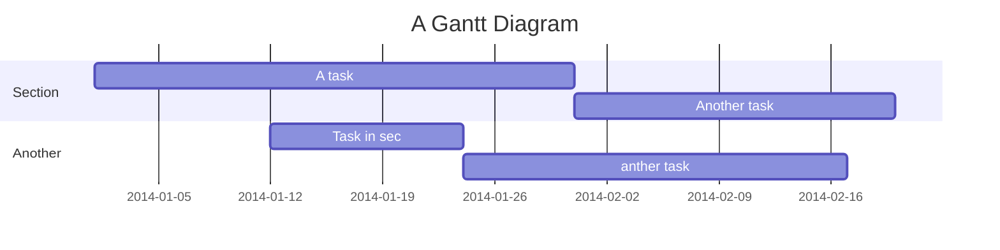

# Project Title


## Overview

[TOC]

## Requirements

Python (3.8.5)

## Learn about

mindmap:https://gitmind.com/app/doc/b3c2649404
mindchart(user):https://gitmind.com/app/flowchart/0f32674809
postman example:https://documenter.getpostman.com/view/13057025/TzecDRFz
functional note:

## Quick start

### Installation

1. Clone the repository
2. create a virtual environment using virtualenv venv
3. Activate the virtual environment by running source venv/bin/activate
4. Install the dependencies

```
pip install -r requirement.txt
```

5. make .env
6. Migrate existing db tables by running python

```
python manage.py makemigrations
python manage.py migrate
```

7. Run the django development server using python

```
manage.py runserver
```

## API Endpoint

athentication

- /auth/register/
- /auth/login/
- /auth/request-reset-email/
- /auth/password-reset/NjY/ao86jf-463b3871cf255a85a4ef41c7424b7893/?redirect_url=

cases

- /cases/
- /cases/<id>

## User flows

```sequence
register
verify email
login -> get Bearer token

case CRUD
point CRUD
```

## api testing

```
//swagger ui
url: {{baseUrl}}/swagger

// postman
in folder postman_examples
```

## Project Timeline



> Read more about mermaid here: http://mermaid-js.github.io/mermaid/

## Appendix and FAQ

:::info
**Find this document incomplete?** Leave a comment!
:::

###### tags: `Templates` `Documentation`
